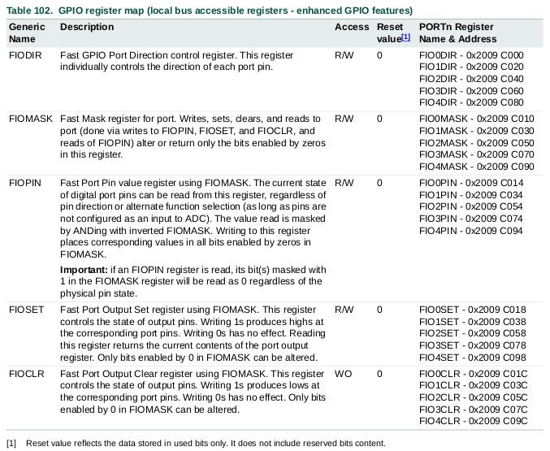
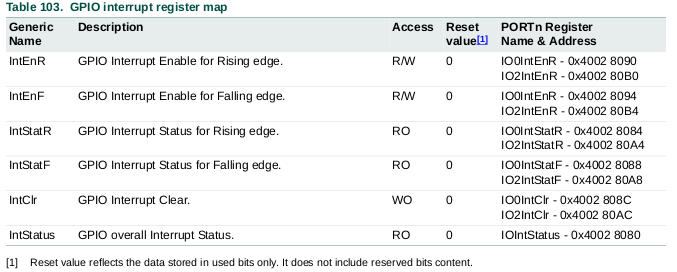

## Electrónica Digital III - UNC - FCEFyN

# GPIO

[Datasheets](https://drive.google.com/drive/folders/10A9xhIxx6ag75GtEwLzxr8pCdP6hR1HC )

Ver capítulo 9 del User Manual.

## Características

### Entradas salidas digitales

- Funciones:
  
  - Los registros de GPIO están ubicados en el AHB bus
  
  - Registros enmascarables permiten modificar conjuntos de puertos como un grupo, dejando otros sin modificar.
  
  - Todos los registros de GPIO accesibles como bytes, half-words y words.
  
  - Todo el puerto puede ser modificado en una sola instrucción.
  
  - Los registros de GPIO son accesibles por el GPDMA.

- Registros de set y clear a nivel de bit permiten con una simple instrucción poner en alto o bajo el estado de cualquier numero de bits en un puerto.

- Todos los registros de GPIO soportan [Cortex-M3 bit-banding](https://developer.arm.com/documentation/ddi0337/h/programmers-model/bit-banding).

- Los registros de GPIO son accesibles por el GPDMA para permitir el acceso directo a memoria de datos hacia o desde los GPIOS, sincronizado con cualquier solicitud de DMA.

- Control de dirección individual por bits.

- **Todos los IO se configuran por defecto luego del reset como entradas con pull-up**

### Interrupciones

- El puerto 0 y puerto 2 pueden proporcionar una sola interrupción para cualquier combinación de pines del puerto.

- Cada puerto puede ser programado para generar una interrupción en un rising edge, falling edge o ambos.

- La detección de flanco es asincrónica, por lo tanto puede funcionar cuando los relojes no están activos, como durante el Power-down mode. 

- Las interrupciones de GPIO0 y GPIO2 comparten la misma posición en el NVIC con "External interrupt 3".

## Registros asociados a la configuración

    Los registros de la siguiente tabla, representan las características disponibles en todos los puertos de GPIO. Estos registros están ubicados en el AHB bus para una lectura y escritura rápida. Todos estos registros pueden ser accedidos en bytes, half-words (2 bytes) y words (4bytes). El registro MASK permite acceder a grupos de bits de un puerto GPIO independientemente de otros bits en el mismo puerto.

    Los siguientes registros están asociados a las interrupciones de GPIO

    A partir de aquí, en el user manual encontraremos la definición a detalle de cada uno de estos registros.

## Ejemplo - Blink

