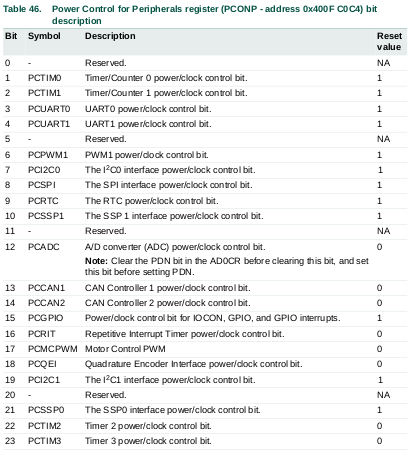
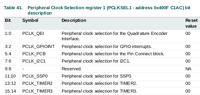
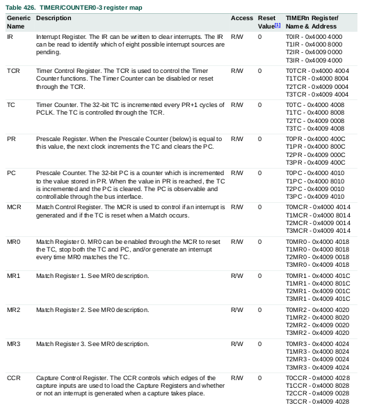
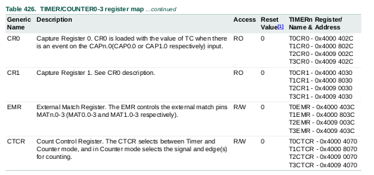
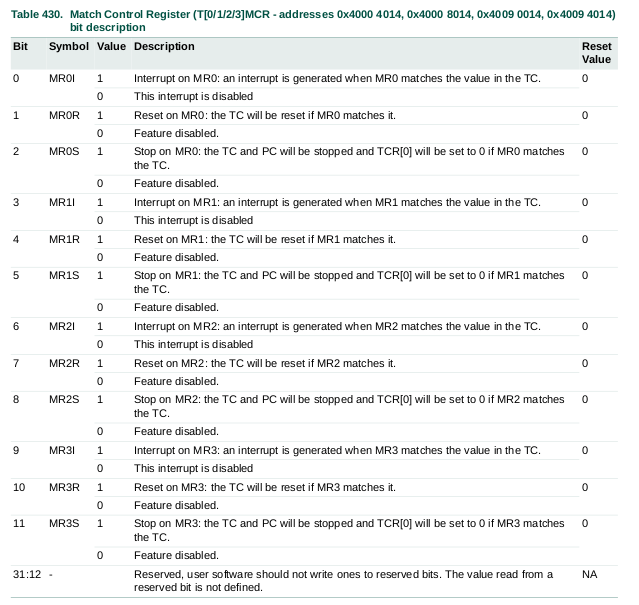
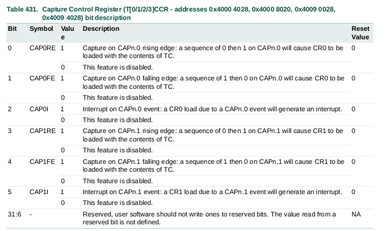
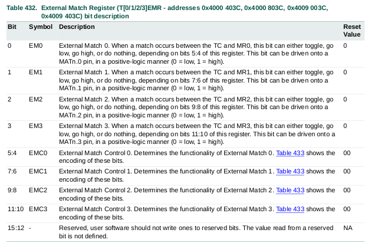

## Electrónica Digital III - UNC - FCEFyN

# Timers

[Datasheets](https://drive.google.com/drive/folders/10A9xhIxx6ag75GtEwLzxr8pCdP6hR1HC)

Ver capítulo 21 del User Manual

## Características

La LPC1769 tiene 4 bloques de timers de 32 bits. Los cuatro timer/counters son identicos (a excepción de la dirección base del perisférico).

Cada uno de estos timer/counters cuenta con:

- Un timer/counter de 32 bits con un prescaler programable de 32 bits.
- Puede ser utilizado como timer o como contador.
- Más de dos cananes de captura de 32 bit, que pueden ser usados para tomar una instantanea del valor del temporizador cuando una señal de entrada cambia su valor. Un evento de captura también puede generar opcionalmente una interrupción.
- Cuatro registros de match de 32 bits que permiten:

    - Operación continua con generación de interrupción en el match.
    - Frenar el timer en el match con opción de generar interrupción.
    - Reiniciar el timer en el match con opción de generar interrupción.

- Más de cuatro salidas externas correspondientes a los registros de match, que permiten:

    - Colocar la salida en un valor 0 en el match.
    - Colocar la salida en un valor 1 en el match.
    - Conmutar la salida (toggle) en el match.

## Aplicaciones
- Temporizador para eventos internos.
- Demodulación de PWM con capturas.
- Temporizador de funcionamiento libre.

## Configuración básica

Para la configuración de cualquiera de los 4 timers se recomienda seguir los siguientes pasos:

### Power
Encender el timer. Para eso tenemos que colocar un '1' en los bits correspondientes del registro PCONP (tabla 46 del manual). Estos bits son PCTIM0/1/2/3. 

**Nota:** Después del RESET los timers 0 y 1 se encuentran encendidos y los 2 y 3 no.

### Peripheral Clock
En el registro PCLKSEL0 (tabla 40) seleccionar la frecuencia de reloj para los timers 0 y 1. En el registro PCLKSEL1 (tabla 41) seleccionar la frecuencia de reloj para los timers 2 y 3.

Se puede optar por 4 diferentes frecuencias: CCLK/4, CCLK, CCLK/2 y CCLK/8 (tabla 42).

### Pins
Seleccionar los pines asociados con las funcionalidades de los timers con el registro PINSEL correspondiente, por ejemplo si queremos usar el match 2 del timer 1 debemos buscar la funcionalidad MAT2.1. Seleccionar los modos de los pines con el registro PINMODE correspondiente. 

### Interrupciones
Ver los registros T0/1/2/3MCR y T0/1/2/3CCR para los eventos de match y captura. Las interrupciones son habilitadas en el NVIC usando el registro de habilitación apropiado.

### DMA
Más de dos condiciones de match pueden ser utilizadas para generar pedidos de DMA (Tabla 544).

## Descripción de pines
En la siguiente tabla se muetra un resumen de los pines relacionados con los timer/counters.

## Descripción de registros
Cada Timer/counter tiene asociados los registros que se muestran a continuación (tabla 426).

### Interrupt Register T[0/1/2/3]IR
Este registro consiste de 4 bits para las interrupciones de match y 2 bits para las interrupciones de captura. Si una interrupción es generada, entonces el bit correspondiente del registro IR tomará un valor alto ('1'). Si no hay ninguna interrupción, el bit tendrá un valor bajo ('0').

Escribir un valor lógico de '1' en el correspondiente bit IR limpia la bandera de interrupción. Escribir un '0' no tendrá ningún efecto. El hecho de limpiar una interrupción de match también limpia cualquier pedido de DMA asociado.

### Timer Control Register T[0/1/2/3]CR
Este registro es usado para controlar la operación de cada timer/counter. Simplemente cuenta con dos bits, uno para habilitar o deshabilitar el contador y otro para reiniciarlo.

### Count Control Register T[0/1/2/3]CTCR
Este registro es utilizado para seleccionar entre el modo timer o modo contador, y en el modo contador para seleccionar el pin y flanco de cuenta.

Cuendo el modo contador es seleccionado como el modo de operación, la entrada CAP (seleccionada con los bits 3:2 de este mismo registro) es muestreada en cada flanco ascendente del PCLK clock.

Luego de comparar dos muestras consecutivas de esta entrada, uno de estos cuatro eventos es reconocido: Flanco ascentente, flanco descendente, ambos flancos o sin cambio de nivel.

Solo si el evento identificado coincida con el evento seleccionado por los bits 1:0 de este registro, el registro Timer Counter incrementará su valor.

El procesamiento de la señal externa tiene algunas limitaiones. Dado que se utilizan dos flancos ascendentes sucesivos del reloj PCLK para identificar un solo flanco en la entrada seleccionada de CAP, la frecuencia de la entrada de CAP no puede exceder un cuarto del reloj PCLK. En consecuencia, la duración de los niveles alto/bajo en la misma entrada CAP no puede ser inferior a 1/(2 PCLK).

### Timer Counter Register T[0/1/2/3]TC
Este registro de 32 bits es incrementado cuando el contador de preescala alcanza su cuenta final. Salvo que sea reiniciado antes de alcanzar su límite superior, el timer counter alcanzará el valor de 0xffffffff y luego volverá al valor 0x00000000.

Este evento no causa una interrupción, pero un registro de match puede ser usado para detectar el overflow del TC enc aso de ser necesario.

### Prescale Register T[0/1/2/3]PR
Este registro de 32 bits especifica el máximo valor para el contador de preescala.

### Prescale Counter Register T[0/1/2/3]PC
Este registro de 32 bits realiza una división del PCLK por algún valor constante antes de ser aplicado al timer counter.

El Prescale Counter es incrementado en cada PCLK. Cuando este alcanza el valor almacenado en el Prescale Register, el Timer Counter es incrementado y el Prescale Counter es reiniciado en el siguiente PCLK. 

Esto causa que el Timer Counter sea incrementado cada PCLK cuando PR=0, cada 2 PCLK cuando PR=1, etc (se incrementa cada 1+PR).

### Match Registers MR0 - MR3
Este registro contiene los valores que son continuamente comparados con el valor del Timer Counter. Cuando ambos valores son iguales, las acciones configuradas se disparan automáticamente. Las posibles acciones son: generar una interrupción, reiniciar el timer counter o parar el timer. Estas acciones son configuradas en el registro MCR.

### Match Control Register T[0/1/2/3]MCR
Este registro es utilizado para controlar que operaciones son realizadas cuando uno de los valores almacenados en los MR coincide con el Timer Counter.

### Capture Registers CR0 - CR1
Cada uno de estos registros está asociado a un pin y puede ser cargado con el valor del Timer Counter cuando un evento específico ocurre en este pin. Las configuraciones en el registro Capture Control Register determina si la función de captura está habilitada y si el evento de captura ocurre en el flanco ascendete, descendente o ambos flancos del pin.

### Capture Control Register T[0/1/2/3]CCR
Este registro es utilizado para controlar si uno de los dos registros de captura es cargado con el valor del Timer Counter cuando el evento de captura ocurre y si una interrupción es generada por dicho evento.

Configurar ambos flancos al mismo tiempo es una configuración válida, esto provoca que el evento de captura se dará en ambos flancos de la señal de entrada.

Nota: Si se selecciona el modo contador para una entrada CAP particular en el registro CTCR, los 3 bits correspondientes a esa entrada en este registro (CCR) deben ser programados como 000, pero la captura y/o interrupción puede ser seleccionada para las otras CAP.

### External Match Register T[0/1/2/3]EMR
Este registro provee el control y estado de los pines externos de match. 

Los eventos de Match0 y Match 1 de cada timer pueden producir un pedido de DMA.

## DMA 
Pedidos de DMA son generados po un match del Timer Counter con uno de los registros MR0 o MR1. Esto no está relacionado con la oepración de las salidas de match controladas por el registro EMR. Cada match setea una bandera de solicitud de DMA, que está conectada con el controlador de DMA. Para que esto tenga efecto, el GPDMA debe configurarse.

## Ejemplos de operación del timer

La siguiente figura muestra un timer configurado para reiniciar la cuenta y generar una interrupción en un match. El prescaler está seteado con un valor de 2 y el registro de match en 6. Al final del ciclo del timer, cuando ocurre el match, el TC es reiniciado. La interrupción que indica que ocurrió una coincidencia se genera en el siguiente clock después de que el cronómetro alcanzó el valor de match.

## Diagrama de bloques

## Cálculos de tiempos

El tiempo requerido por un ciclo de reloj cuando la frecuencia del clock es PCLK está dado por:

$$
T_{PCLK} = \frac{1}{PCLK_{Hz}} [s]
$$

Esta es la máxima resolución que el bloque timer puede proveer. La formula generalizada de esta resolución teniendo en cuenta el prescaler es la siguiente:

$$
T_{RES} = \frac{PR+1}{PCLK_{Hz}}
$$

Luego, podemos obtener la ecuación para el prescaler para una determinada resolución del timer:

$$
PR = (T_{RES} * PCLK_{Hz}) -1
$$

Notar que aqui, la resolución del timer es el tiempo necesario para que el TC sea incrementado en 1.

Esto puede utilizarse para calcular el valor del prescaler para obtener un tiempo específico. Por ejemplo, el valor del prescaler para una temporización de $1[\mu s]$ y una frecuencia de clocl de $25[MHz]$ será:

$$
PR_{1\mu s} = (25[MHz] * 1[\mu s])-1 = 24
$$

La máxima resolución que puede lograrse es de $10[ns]$ cuando se utiliza una frecuencia de $100[MHz]$ y $PR=0$.

## Ejemplos de código
Revisar el directorio `src`.

En el ejemplo planteado, se genera una señal cuadrada de frecuencia variable utilizando el timer 0 en modo match. La frecuencia se actualiza a través de una interrupción externa en EINT0. 
Luego, Se utiliza el timer 1 en modo captura para calcular el periodo de la señal generada (para probarlo será necesario conectar el pin 1.28 (MAT0.0) con el pin 1.18 (CAP1.0)).