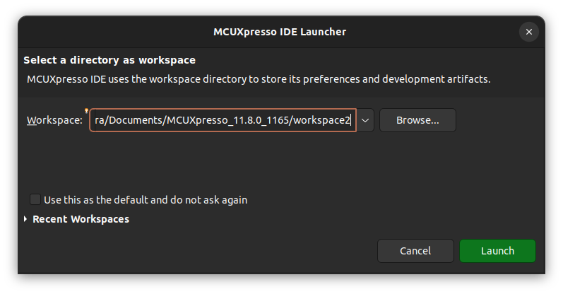
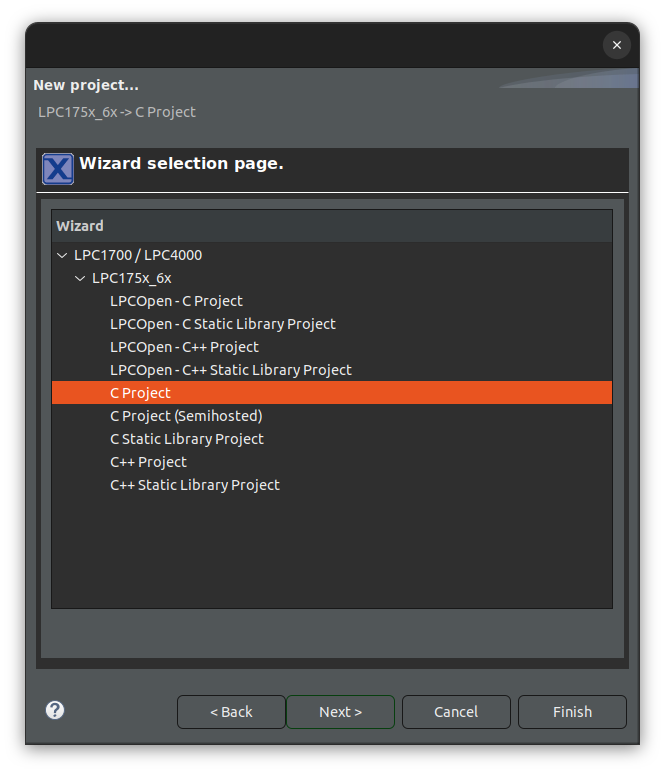
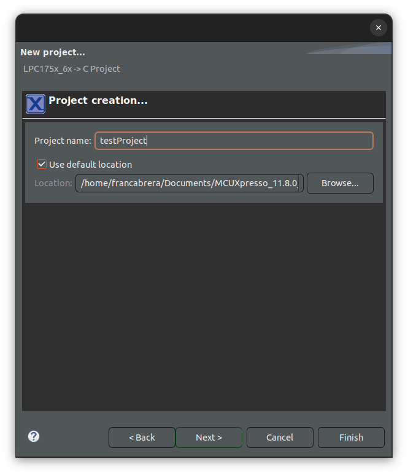
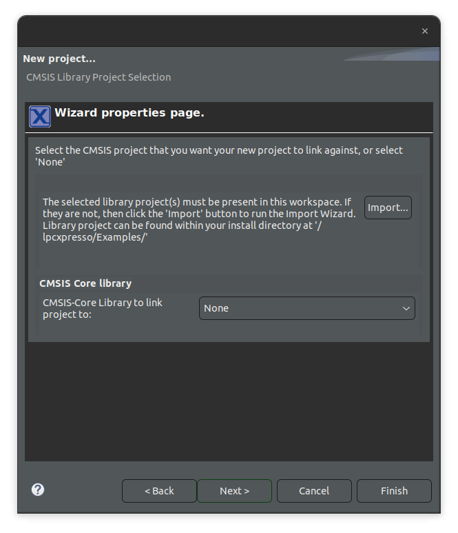
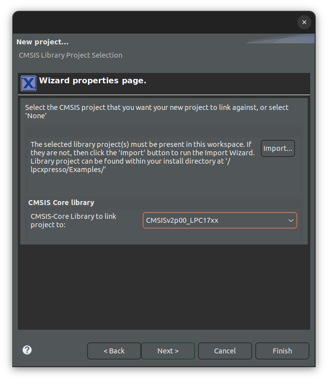
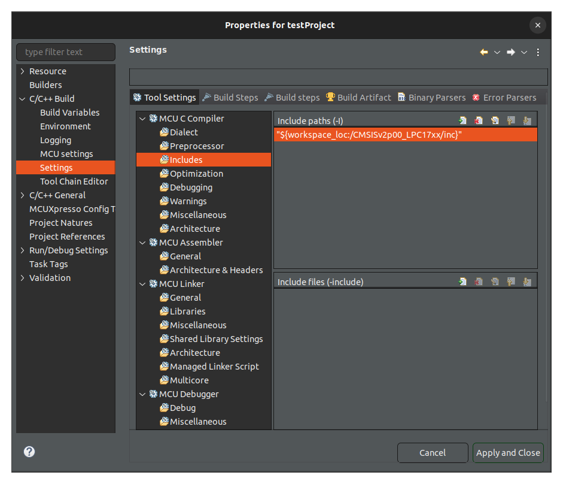
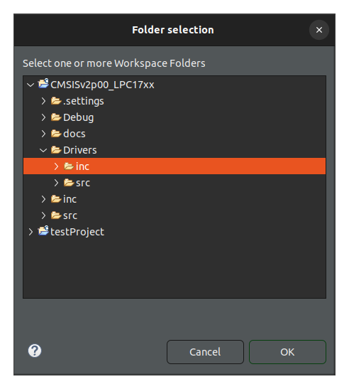

## Electrónica Digital III - UNC - FCEFyN

# Drivers

[Datasheets](https://drive.google.com/drive/folders/10A9xhIxx6ag75GtEwLzxr8pCdP6hR1HC)

En el drive se encuentra el .zip necesario para incluir los drivers a nuestro proyecto.

## ¿Qué son los Drivers?

La especificación CMSIS-Driver es una API de software que provee funciones para la configuración y uso de periféricos. Esto, nos permite generar una abstracción del hardware ya que nos aísla de los detalles específicos del microcontrolador.

## Incluir Drivers en un proyecto

Inicialmente, abrimos MCUXpresso IDE y seleccionamos un nuevo espacio de trabajo.



Una vez en el nuevo espacio de trabajo, debemos crear un nuevo proyecto. Para esto, vamos a `file > new > create a new C/C++ project` y se nos abrirá el wizard.

Seleccionamos la placa (LPC1769)


Seleccionamos el tipo de proyecto (C project)



Colocamos un nombre al proyecto.



En este punto, se nos solicita que importemos las librerías a usar. Para esto, hacer click en "import" y seleccionar el .zip que se descargó del drive (CMSISv2p00_LPC17xx.zip).




Una vez importada, seleccionarla como librería del proyecto.



Al finalizar la creación del proyecto, podemos observar en el project manager que se importó correctamente la librería.


El último paso para configurar el uso de drivers, es añadir el path de los drivers a los include del proyecto. Para esto, hacer click derecho sobre el nombre del proyecto (el que creamos) y abrir las propiedades.

Dentro de las propiedades nos dirigimos a `C/C++ Build > Settings > Includes`. 



En la pestaña de "include paths" seleccionamos la opción para añadir uno nuevo, esto nos abrirá la siguiente ventana:


Debemos seleccionar "Workspace" para buscar las librerías incluidas en nuestro espacio de trabajo. Aquí, debemos seleccionar el directorio "CMSISv2p00_LPC17xx/Drivers/inc".



Aplicar los cambios y cerrar.

### Errores de compilación
Si intentamos compilar el proyecto nos dará algunos errores en algunos archivos.

- **lpc17xx_clkpwr.h**
    - En la línea 31 cambiar `#include <lpc17xx.h>` por `#include <LPC17xx.h>`.

- **lpc17xx_pinsel.h**
    - En la línea 31 cambiar `#include <lpc17xx.h>` por `#include <LPC17xx.h>`.

- **lpc28xx_libcfg_default.h**
    - En la línea 42, eliminar la redefinición `#define DEBUG`.

- **lpc17xx_can.c**
    - En la línea 164, eliminar la variable `volatile uint32_t temp` (unused).

## Ejemplo
A continuación se presenta un ejemplo simple para verificar el funcionamiento de los drivers.

```c
#include "LPC17xx.h"

#include "lpc17xx_pinsel.h"
#include "lpc17xx_gpio.h"

#define PIN22  ((uint32_t) (1<<22))
#define PORT0  ((uint8_t)  (0))
#define OUTPUT ((uint8_t)  (1))

void delay(uint32_t times);

int main(void)
{
	PINSEL_CFG_Type pinselCfg;
	pinselCfg.Portnum = PINSEL_PORT_0;
	pinselCfg.Pinnum = PINSEL_PIN_22;
	pinselCfg.Funcnum = PINSEL_FUNC_0;
	pinselCfg.Pinmode = PINSEL_PINMODE_NORMAL;

	PINSEL_ConfigPin(&pinselCfg);

	GPIO_SetDir(PORT0, PIN22, OUTPUT);

	while(1)
	{
		GPIO_SetValue(PORT0, PIN22);
		delay(1000);
		GPIO_ClearValue(PORT0, PIN22);
		delay(1000);

	}


    return 0 ;
}

void delay(uint32_t times)
{
	for(int i=0; i<times; i++)
		for(int j=0; j<times; j++);

}

```

### Otro ejemplo
Un ejemplo más complejo se puede encontrar en el directorio `src`. Es el mismo ejemplo que se vió en Timers pero implementado con drivers.