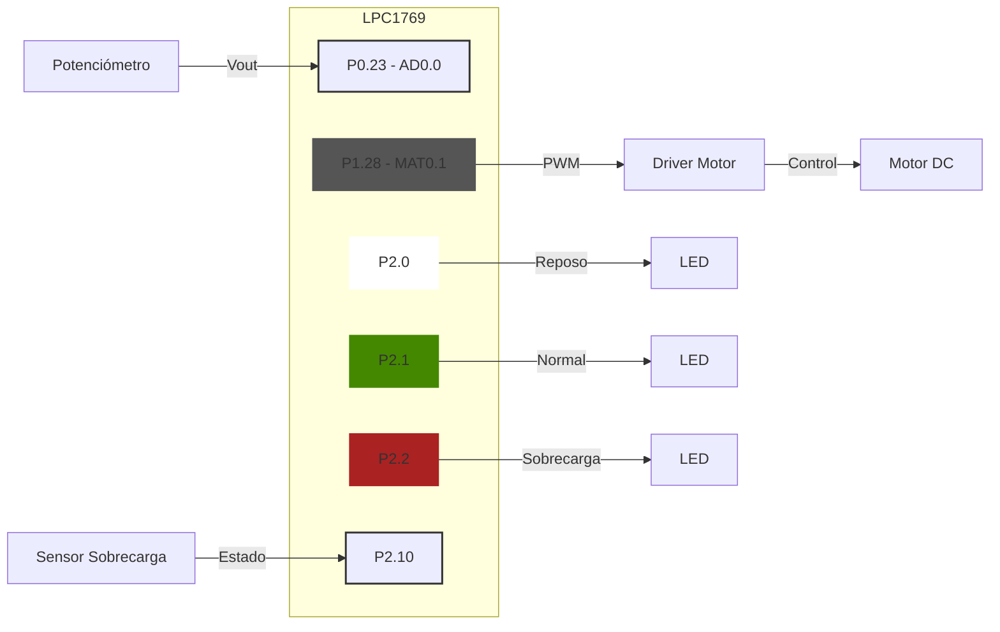

# Problema: Sistema de Control de Velocidad para Motor DC

### Objetivo:
Diseñar un sistema de control de velocidad para un motor DC utilizando la LPC1769. 
El sistema utilizará un potenciómetro para ajustar la velocidad deseada, y empleará PWM para controlar la velocidad real del motor. 
Además, implementará un sistema de monitoreo y seguridad. Si detecta una sobrecarga, reducirá la velocidad del motor.

### Requisitos:
- Utilizar el ADC para leer la posición del potenciómetro, que representará la velocidad deseada.
- Implementar un timer para generar una señal PWM que controle la velocidad del motor.
- Utilizar otro timer para muestrear periódicamente la velocidad actual del motor (simulada).
- Emplear interrupciones para manejar las lecturas del ADC y las acciones de los timers.

### Estados de Operación:
1. **Reposo**: Motor apagado (0% duty cycle)
2. **Normal**: Motor funcionando a la velocidad deseada
3. **Sobrecarga**: Motor funcionando a velocidad reducida

### Sistema de Seguridad:
- Implementar un sistema de seguridad que detecte sobrecargas (por un pin que tenga un sensor) y ajuste el estado del sistema.

### Indicadores:
- Utilizar LEDs para indicar el estado actual del sistema.

# Explicación de la Implementación

### Configuración del ADC:
- Se configura el pin `P0.23` como entrada analógica (`AD0.0`).
- Se inicializa el ADC con una frecuencia de 200kHz.
- Se habilita la interrupción para el canal 0 del ADC.

### Configuración de Timers:
- `TIMER0` se configura para generar una señal PWM de 10kHz.
- `TIMER1` se configura para generar una interrupción cada 100ms.

### Configuración de GPIO:
- `P1.28` se configura como salida para la señal PWM (`MAT0.1`).
- `P2.0`, `P2.1` y `P2.2` se configuran como salidas para los LEDs indicadores.

### Manejo de Interrupciones:
- En la interrupción del ADC, se lee el valor del potenciómetro y se actualiza la velocidad deseada.
- En la interrupción de `TIMER1`, se simula la lectura de la velocidad actual, verifica si se detecta sobrecarga y se actualiza el estado del sistema.

### Lógica Principal:
- La función `actualizar_estado_sistema()` maneja los cambios entre estados y ajusta el PWM y los LEDs en consecuencia.

# Diagrama ilustrativo
