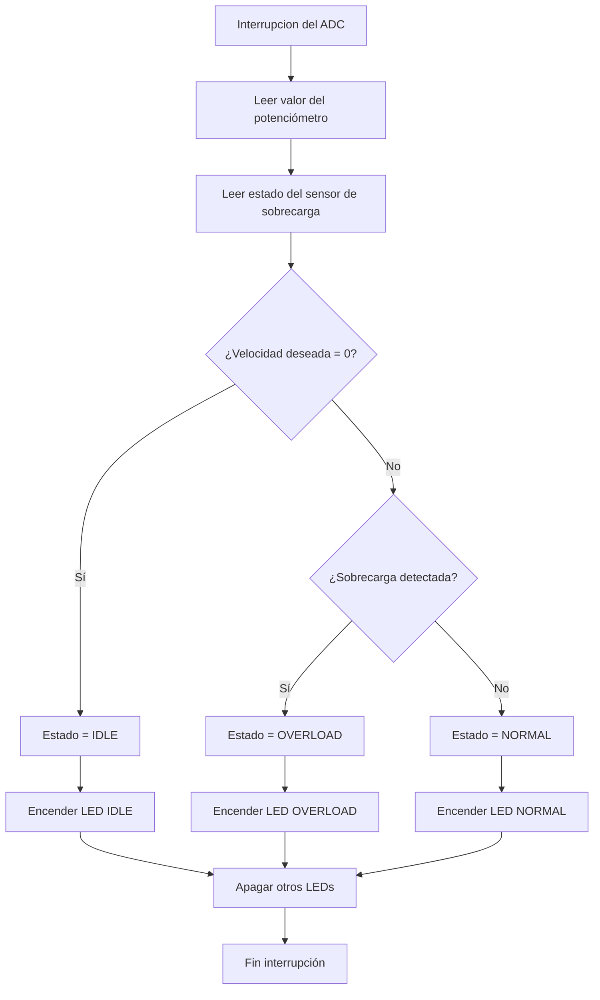
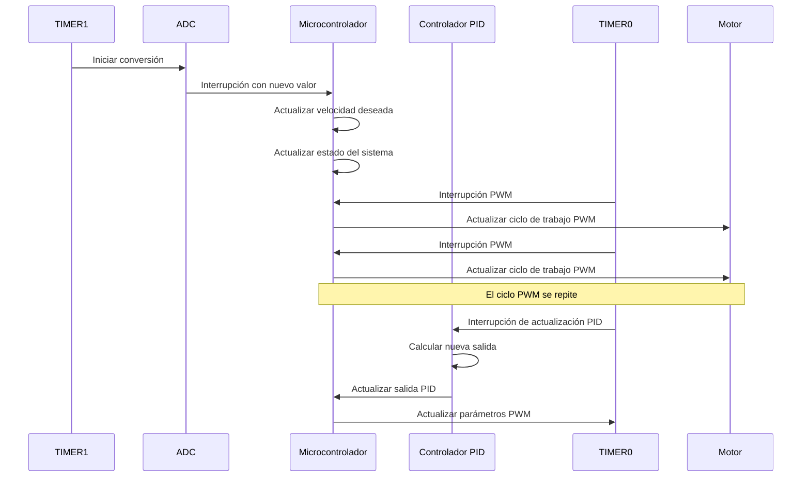

# Problema: Sistema de Control de Velocidad para Motor DC

### Objetivo:
Diseñar un sistema de control de velocidad para un motor DC utilizando la LPC1769. 
El sistema utilizará un potenciómetro para ajustar la velocidad deseada, y empleará PWM para controlar la velocidad real del motor. 
Además, implementará un sistema tal que si detecta una sobrecarga, reducirá la velocidad del motor a un 80% de la velocidad deseada.

### Requisitos:
- Utilizar el ADC para leer la posición del potenciómetro, que representará la velocidad deseada.
- Implementar un timer para generar una señal PWM de 10kHz que controle la velocidad del motor.
- Utilizar otro timer para accionar el ADC. 

### Estados de Operación:
1. **Reposo**: Motor apagado (0% duty cycle)
2. **Normal**: Motor funcionando a la velocidad deseada
3. **Sobrecarga**: Motor funcionando a velocidad reducida (reducir duty cycle en un 20%)

### Sistema de Seguridad:
- Detectar condiciones de sobrecarga mediante un sensor conectado a un pin GPIO.

### Indicadores:
- Utilizar LEDs para indicar el estado actual del sistema.

# Explicación de la Implementación

### Configuración del ADC:
- Se configura el pin `P0.23` como entrada analógica (`AD0.0`).
- Se inicializa el ADC con una frecuencia de 200kHz.
- Se habilita la interrupción para el canal 0 del ADC.

### Configuración de Timers:
- `TIMER0` se configura para generar una señal PWM de 10kHz.
- `TIMER1` se configura para accionar el ADC y medir la velocidad deseada cada 20ms

### Configuración de GPIO:
- `P1.28` se configura como salida para la señal PWM (`MAT0.0`).
- `P2.0`, `P2.1` y `P2.2` se configuran como salidas para los LEDs indicadores.
- `P2.10` se configura como entrada para el sensor de sobrecarga.

### Manejo de Interrupciones:
- En la interrupción del ADC, se lee el valor del potenciómetro, sobrecarga y se actualiza la velocidad deseada.
- En la interrupción del Timer0, se actualiza el valor de coincidencia para el PWM. 

# Diagrama ilustrativo

# Diagrama de flujos

```mermaid
graph TD

subgraph Inicio
    A[Inicio] --> B[Configurar ADC]
    B --> C[Configurar Timers]
    C --> D[Configurar GPIO]
    D --> E[Bucle Principal]
    E --> E
end
 
subgraph Timer0
    F[Interrupción TIMER0] --> G{¿Estado PWM = TON?}
    G -->|Sí| H[Cambiar a TOFF]
    G -->|No| I[Cambiar a TON]
    H --> J[Calcular tiempo en alto]
    I --> K[Calcular tiempo en bajo]
    J --> L[Actualizar valor de comparación del temporizador]
    K --> L
    L --> M[Limpiar bandera de interrupción]
    M --> N[Fin interrupción]
  
  end


subgraph Timer2
    O[Interrupción Timer2] --> P[Obtener velocidad real]
    P --> Q[Calcular error]
    Q --> R[Calcular integral del error]
    R --> S[Calcular derivada del error]
    S --> T[Calcular salida PID]
    T --> U[Limitar salida PID a 0-100%]
    U --> V{¿Estado = OVERLOAD?}
    V -->|Sí| W[Reducir salida al 80%]
    V -->|No| X[Usar salida completa]
    W --> Y[Actualizar PWM]
    X --> Y
    Y --> Z[Fin interrupción] 

end

```  

# Diagrama de flujos de la interrupción del ADC

# Diagrama de secuencia

