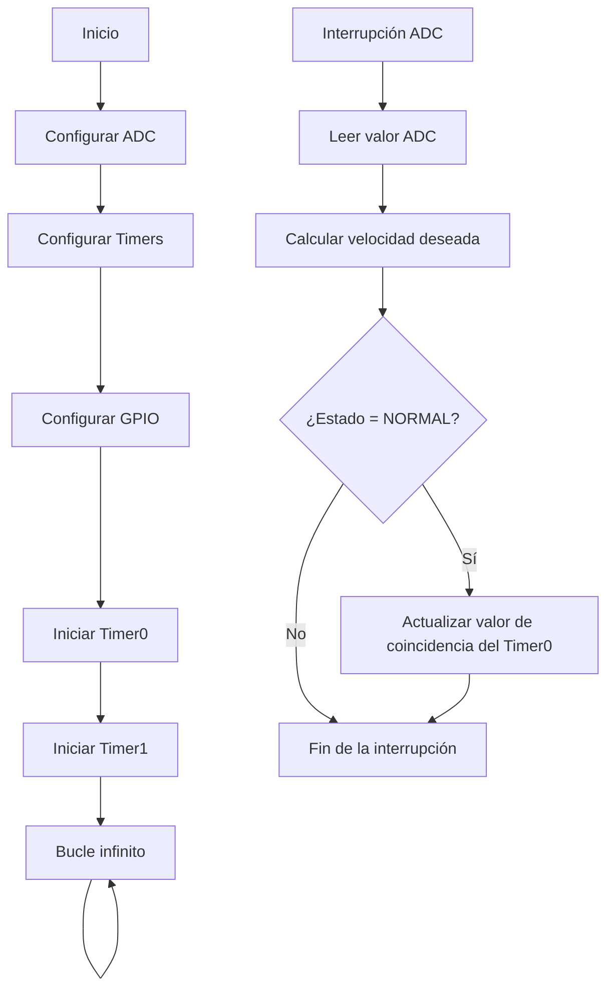
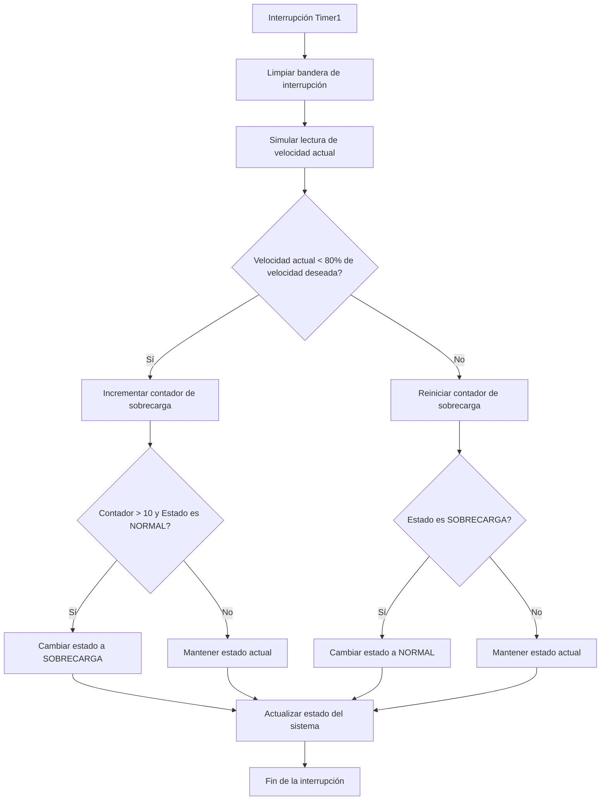

Principal:

# Interrupción del Timer1

 

```mermaid

graph TD
    A[Inicio] --> B[Configurar ADC]
    B --> C[Configurar Timers]
    C --> D[Configurar GPIO]
    D --> E[Iniciar Timer0]
    E --> F[Iniciar Timer1]
    F --> G[Bucle infinito]
    G --> G

 
    H[Interrupción ADC] --> I[Leer valor ADC]
    I --> J[Calcular velocidad deseada]
    J --> K{¿Estado = NORMAL?}
    K -->|Sí| L[Actualizar valor de coincidencia del Timer0]
    K -->|No| M[Fin de la interrupción]
    L --> M

```

Diagrama de flujo de la interrupción del Timer1

```mermaid
graph TD
    A[Interrupción Timer1] --> B[Limpiar bandera de interrupción]
    B --> C[Simular lectura de velocidad actual]
    C --> D{Velocidad actual < 80% de velocidad deseada?}
    D -->|Sí| E[Incrementar contador de sobrecarga]
    D -->|No| F[Reiniciar contador de sobrecarga]
    E --> G{Contador > 10 y Estado es NORMAL?}
    G -->|Sí| H[Cambiar estado a SOBRECARGA]
    G -->|No| I[Mantener estado actual]
    F --> J{Estado es SOBRECARGA?}
    J -->|Sí| K[Cambiar estado a NORMAL]
    J -->|No| L[Mantener estado actual]
    H --> M[Actualizar estado del sistema]
    I --> M
    K --> M
    L --> M
    M --> N[Fin de la interrupción]
```

 