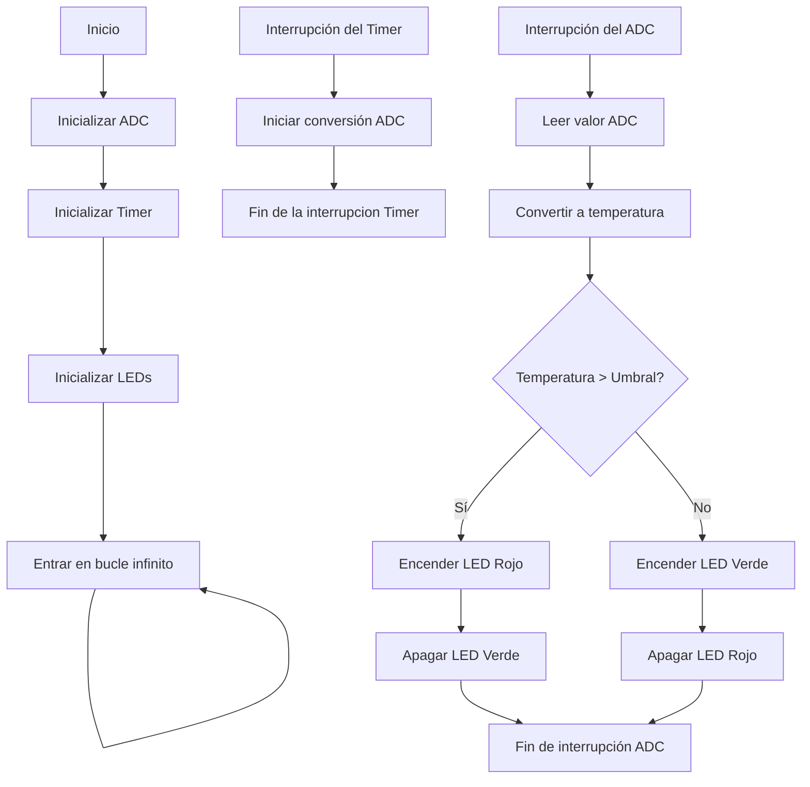

# Diagrama de flujos
 

```mermaid
graph TD
    A[Inicio] --> B[Inicializar ADC]
    B --> C[Inicializar Timer]
    C --> D[Inicializar LEDs]
    D --> E[Entrar en bucle infinito]
    E --> E

    F[Interrupción del Timer] --> G[Iniciar conversión ADC]
    G --> H[Fin de la interrupcion Timer]

    I[Interrupción del ADC] --> J[Leer valor ADC]
    J --> K[Convertir a temperatura]
    K --> L{Temperatura > Umbral?}
    L -->|Sí| M[Encender LED Rojo]
    L -->|No| N[Encender LED Verde]
    M --> O[Apagar LED Verde]
    N --> P[Apagar LED Rojo]
    O --> Q[Fin de interrupción ADC]
    P --> Q
    
    
``` 