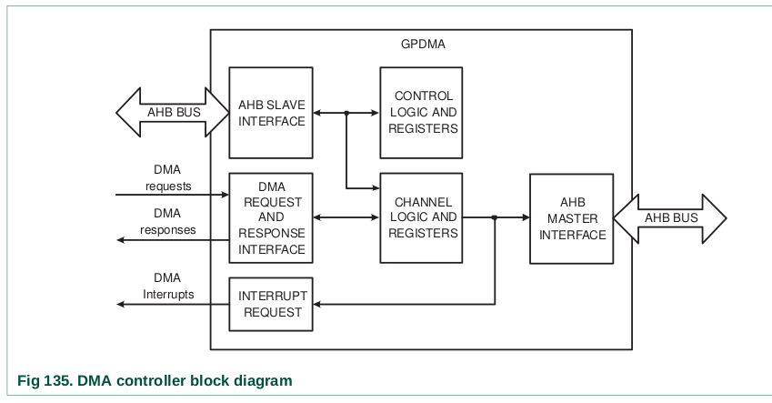

# GPDMA (General Purpose Direct Memory Access)

El DMA (Direct Memory Access) permite realizar transferencias de datos entre periféricos y memoria, así como entre zonas de memoria, sin intervención directa del procesador, lo que mejora la eficiencia del sistema


## Características principales

- Ocho canales de DMA: Cada canal soporta una transferencia unidireccional.

- 16 líneas de solicitud de DMA.
- Soporte para transferencias:
        Memoria a memoria (M2M)
        Memoria a periférico (M2P)
        Periférico a memoria (P2M)
        Periférico a periférico (P2P)
- El GPDMA soporta los siguientes periféricos:
        
        - SSP, I2S, UART, ADC y DAC.
        - También puede ser activado por match de timers
        - Soporte para transferencias de GPIO.

- Soporte para Scatter/Gather DMA: Permite que las áreas de origen y destino no sean contiguas mediante el uso de listas enlazadas.
- Prioridad de canal DMA basada en hardware.
- Interfaz de programación DMA esclavo AHB: El controlador DMA se programa escribiendo en los registros de control del DMA a través de la interfaz AHB esclava.
- Un maestro AHB para transferir datos: La interfaz transfiere datos cuando una solicitud DMA está activa.
- Ancho del bus maestro AHB de 32 bits.
- Direccionamiento programable de incremento o no incremento para las direcciones de origen y destino.
- Tamaño de ráfaga DMA programable: Se puede programar para transferir datos de manera más eficiente.
- FIFO interno de cuatro palabras por canal.
- Soporte para transacciones de 8 bits, 16 bits y 32 bits.
- Soporte para modos Big-endian y Little-endian (esto quiere decir que se puede configurar el orden de los bytes en la transferencia).
        Nota: Por defecto, el controlador DMA opera en modo Little-endian tras el reinicio.
- Interrupciones al procesador: Se pueden generar interrupciones cuando se completa una transferencia DMA o si ocurre un error.
- Estado de interrupciones en crudo: Se puede leer el estado de interrupción antes de aplicar la máscara para errores DMA y el conteo DMA.
- El DMA puede operar en Sleep Mode.
        Nota: En Sleep Mode, el GPDMA no puede acceder a la memoria flash.




# Uso de la librería

### Inicialización:
Antes de iniciar cualquier transferencia DMA, inicializa el controlador GPDMA utilizando la función `GPDMA_Init()`. Esta función habilita el reloj del GPDMA, reinicia la configuración de todos los canales DMA y limpia cualquier interrupción pendiente o errores.


```c
GPDMA_Init(); 
``` 

### Estructura GPDMA_Channel_CFG_Type 
 
Esta estructura define la configuración de un canal de GPDMA.  Luego, llama a GPDMA_Setup() para configurar el canal. Los campos de la estructura son los siguientes:

```c
ChannelNum:    // Número del canal DMA, debe estar en el rango de 0 a 7. El canal 0 tiene la mayor prioridad y el canal 7 tiene la menor prioridad.

TransferSize:  // Longitud o tamaño de la transferencia (cantidad de elementos)

TransferWidth: // Ancho de transferencia - usado solo cuando el tipo de transferencia es M2M.

SrcMemAddr:    // Dirección física de origen, utilizada cuando el tipo de transferencia es M2M o M2P.

DstMemAddr;    // Dirección física de destino, utilizada cuando el tipo de transferencia es M2M o P2M

TransferType;  // Tipo de transferencia, debe ser uno de los siguientes:
                    - GPDMA_TRANSFERTYPE_M2M: Memoria a memoria 
                    - GPDMA_TRANSFERTYPE_M2P: Memoria a periférico 
                    - GPDMA_TRANSFERTYPE_P2M: Periférico a memoria 
                    - GPDMA_TRANSFERTYPE_P2P: Periférico a periférico  

SrcConn;       // Tipo de conexión de periférico de origen, utilizado cuando el tipo de transferencia es P2M o P2P. Debe ser uno de los siguientes
                    - GPDMA_CONN_ADC: ADC
                    - GPDMA_CONN_DAC: DAC
                    - GPDMA_CONN_UART0_Tx_MAT0_0: UART0 Tx / MAT0.0
                    - GPDMA_CONN_UART0_Rx_MAT0_1: UART0 Rx / MAT0.1
                    - GPDMA_CONN_UART1_Tx_MAT1_0: UART1 Tx / MAT1.0
                    - GPDMA_CONN_UART1_Rx_MAT1_1: UART1 Rx / MAT1.1
                    - GPDMA_CONN_UART2_Tx_MAT2_0: UART2 Tx / MAT2.0
                    - GPDMA_CONN_UART2_Rx_MAT2_1: UART2 Rx / MAT2.1
                    - GPDMA_CONN_UART3_Tx_MAT3_0: UART3 Tx / MAT3.0
                    - GPDMA_CONN_UART3_Rx_MAT3_1: UART3 Rx / MAT3.1 
                    - ....

DstConn:       // Tipo de conexión de periférico de destino, utilizado cuando el tipo de transferencia es M2P o P2P. Debe ser uno de los siguientes:
                    - GPDMA_CONN_ADC: ADC
                    - GPDMA_CONN_DAC: DAC
                    - GPDMA_CONN_UART0_Tx_MAT0_0: UART0 Tx / MAT0.0
                    - GPDMA_CONN_UART0_Rx_MAT0_1: UART0 Rx / MAT0.1
                    - GPDMA_CONN_UART1_Tx_MAT1_0: UART1 Tx / MAT1.0
                    - GPDMA_CONN_UART1_Rx_MAT1_1: UART1 Rx / MAT1.1
                    - GPDMA_CONN_UART2_Tx_MAT2_0: UART2 Tx / MAT2.0
                    - GPDMA_CONN_UART2_Rx_MAT2_1: UART2 Rx / MAT2.1
                    - GPDMA_CONN_UART3_Tx_MAT3_0: UART3 Tx / MAT3.0
                    - GPDMA_CONN_UART3_Rx_MAT3_1: UART3 Rx / MAT3.1 
                    - .... 

DMALLI;         // Dirección de la estructura de elemento de lista enlazada si no hay lista enlazada, establecer en '0'. 

```

Ejemplo de configuración de un canal DMA:

```c
uint32_t sourceBuffer[256]; // Buffer de origen
uint32_t destinationBuffer[256]; // Buffer de destino


GPDMA_Channel_CFG_Type dmaConfig;
dmaConfig.ChannelNum = 0; // Canal 0
dmaConfig.TransferSize = 256; // Transferir 256 unidades de datos
dmaConfig.TransferWidth = 4; // Transferir en bloques de 4 bytes
dmaConfig.SrcMemAddr = (uint32_t)&sourceBuffer;
dmaConfig.DstMemAddr = (uint32_t)&destinationBuffer;
dmaConfig.TransferType = GPDMA_TRANSFERTYPE_M2M;
dmaConfig.SrcConn = 0; // No se usa para transferencias de M2M
dmaConfig.DstConn = 0; // No se usa para transferencias de M2M
dmaConfig.DMALLI = 0;  
 
Status status = GPDMA_Setup(&dmaConfig); // Puede devolver SUCCESS o ERROR 
if (status == SUCCESS) {
    // Configuración exitosa
} else {
    // Error en la configuración
}

```


### Habilitar un Canal DMA: 

Después de la configuración, es necesario habilitar el canal para que comience la transferencia.

```c
GPDMA_ChannelCmd(0, ENABLE);
```

 
 
### LLI (Linked List Item) - Elemento de Lista Enlazada

El LLI (Linker List Item) es una estructura utilizada en las transferencias DMA (Direct Memory Access) para realizar transferencias encadenadas, es decir, una serie de transferencias automáticas sin intervención del procesador entre cada una de ellas. Cada elemento LLI contiene la información necesaria para una transferencia DMA, así como un puntero al siguiente LLI en la cadena. Esto permite que el DMA continúe con la siguiente transferencia automáticamente una vez que finaliza la anterior.

### Estructura GPDMA_LLI_Type

La estructura GPDMA_LLI_Type define un elemento de lista enlazada (LLI) para una transferencia DMA. Los campos de la estructura son los siguientes:

```c
SrcAddr;   // Dirección de memoria fuente (Source Address)

DstAddr;   // Dirección de memoria destino (Destination Address) 

NextLLI;   // Dirección del siguiente LLI, o '0' si es el último elemento

Control;   // Bits de control del DMA (tamaño, ancho, incremento, etc.)

                      (TransferSize << 0) |   // Tamaño de la transferencia en bytes
                      (SourceBurstSize << 12) |   // Tamaño del burst en origen
                      (DestinationBurstSize << 15) | // Tamaño del burst en destino
                      (SourceWidth << 18) |    // Ancho de los datos en origen
                      (DestinationWidth << 21) | // Ancho de los datos en destino
                      (1 << 26) |              // Incrementar dirección de origen
                      (1 << 27) |              // Incrementar dirección de destino
                      (1 << 31);               // Habilitar interrupción al finalizar

```

### Ejemplo de transferencia DMA con lista enlazada:

Supongamos que queremos mover bloques de datos desde dos ubicaciones en la memoria (source_block1 y source_block2) hacia dos destinos diferentes (dest_block1 y dest_block2) utilizando LLIs. 

    1024 bytes desde source_block1 a dest_block1.
    512 bytes desde source_block2 a dest_block2.


```c
#define BLOCK1_SIZE 1024
#define BLOCK2_SIZE 512

uint8_t source_block1[BLOCK1_SIZE];
uint8_t dest_block1[BLOCK1_SIZE];

uint8_t source_block2[BLOCK2_SIZE];
uint8_t dest_block2[BLOCK2_SIZE];


GPDMA_LLI_Type LLI1, LLI2;

// Configurar LLI1 para transferir el primer bloque de datos
LLI1.SrcAddr = (uint32_t) &source_block1;  // Dirección de la fuente (primer bloque)
LLI1.DstAddr = (uint32_t) &dest_block1;    // Dirección del destino (primer bloque)
LLI1.NextLLI = (uint32_t) &LLI2;           // Enlazar al siguiente LLI (LLI2)
LLI1.Control = (BLOCK1_SIZE << 0)         // Tamaño de la transferencia (1024 bytes)
              | (GPDMA_BSIZE_32 << 12)    // Tamaño del burst (32 transferencias)
              | (GPDMA_WIDTH_BYTE << 18)  // Ancho de la transferencia (1 byte)
              | (1 << 26)                 // Incremento de la dirección de origen
              | (1 << 27)                 // Incremento de la dirección de destino
              | (1 << 31);                // Habilitar interrupción al finalizar

// Configurar LLI2 para transferir el segundo bloque de datos
LLI2.SrcAddr = (uint32_t) &source_block2;  // Dirección de la fuente (segundo bloque)
LLI2.DstAddr = (uint32_t) &dest_block2;    // Dirección del destino (segundo bloque)
LLI2.NextLLI = 0;                          // Último LLI, no hay más transferencias
LLI2.Control = (BLOCK2_SIZE << 0)         // Tamaño de la transferencia (512 bytes)
              | (GPDMA_BSIZE_32 << 12)    // Tamaño del burst (32 transferencias)
              | (GPDMA_WIDTH_BYTE << 18)  // Ancho de la transferencia (1 byte)
              | (1 << 26)                 // Incremento de la dirección de origen
              | (1 << 27)                 // Incremento de la dirección de destino
              | (1 << 31);                // Habilitar interrupción al finalizar


GPDMA_Channel_CFG_Type channelConfig;

channelConfig.ChannelNum = 0;  // Usar el canal 0
channelConfig.TransferSize = BLOCK1_SIZE;  // Tamaño del primer bloque de datos
channelConfig.TransferWidth = GPDMA_WIDTH_BYTE;  // Transferencia de 1 byte por ciclo
channelConfig.SrcMemAddr = (uint32_t) &source_block1;  // Dirección de origen
channelConfig.DstMemAddr = (uint32_t) &dest_block1;    // Dirección de destino
channelConfig.TransferType = GPDMA_TRANSFERTYPE_M2M;   // Memoria a memoria
channelConfig.DMALLI = (uint32_t) &LLI1;               // Apuntar al primer LLI


// Para iniciar la transferencia, primero configuramos el canal
GPDMA_Setup(&channelConfig);

// Luego, habilitamos el canal
GPDMA_ChannelCmd(0, ENABLE); // aqui se inicia la transferencia
```

